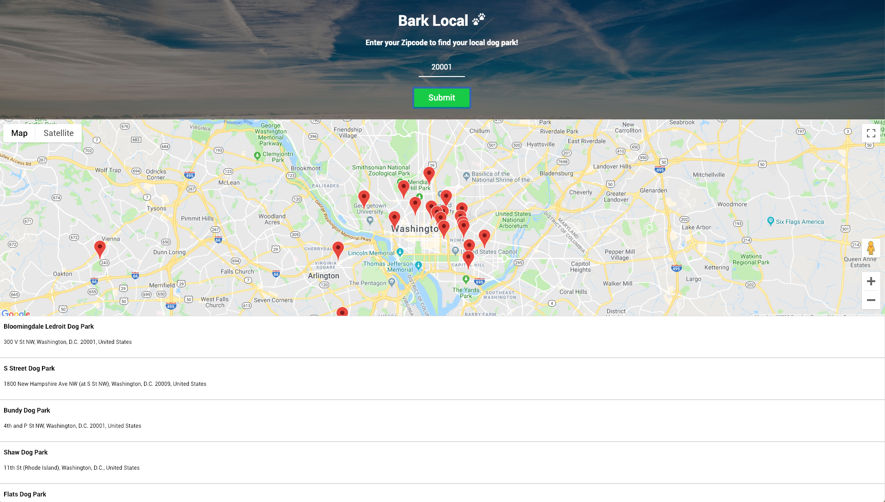

# Bark Local

View a live demo [here](https://nathancleon.github.io/bark-local/ "Mentalnote")!

## About The App

The intention behind Bark Local is for the user to be able to search for any and all dog parks near the zip code entered. The map then displays a list of dog parks at the bottom and clickable map markers with descriptions.

## Technology Stack

The application was built using HTML, CSS, and jQuery and utilized the Google Maps and Foursquare APIs.
